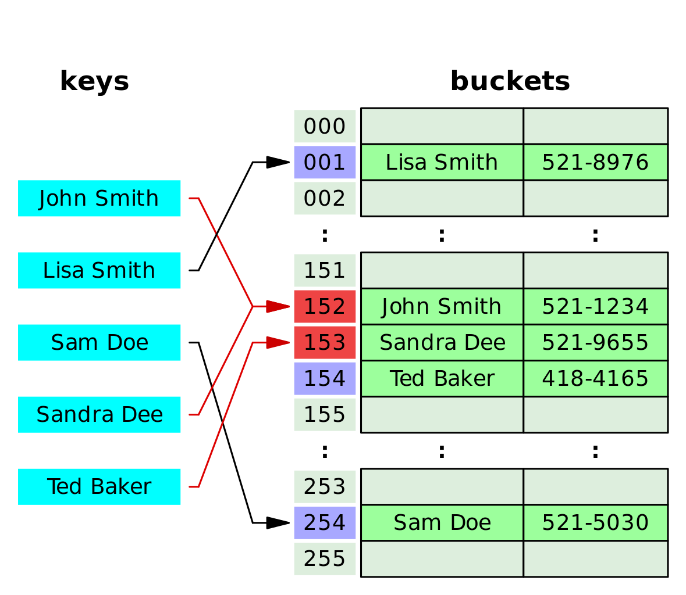
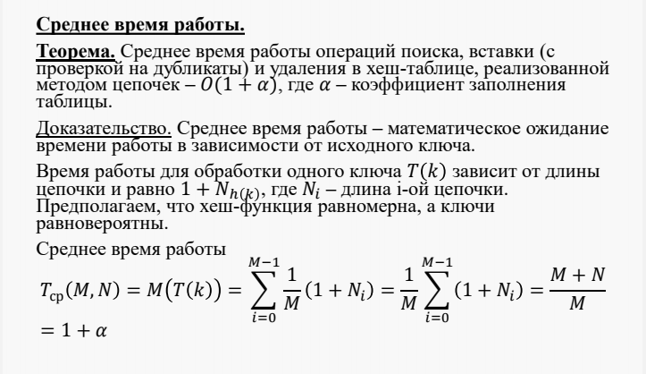
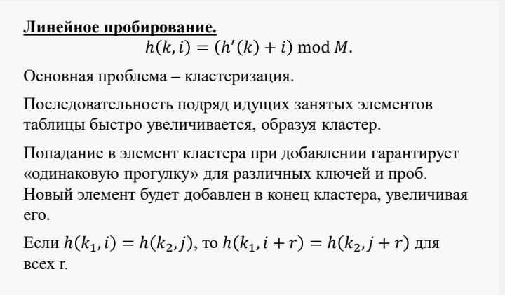
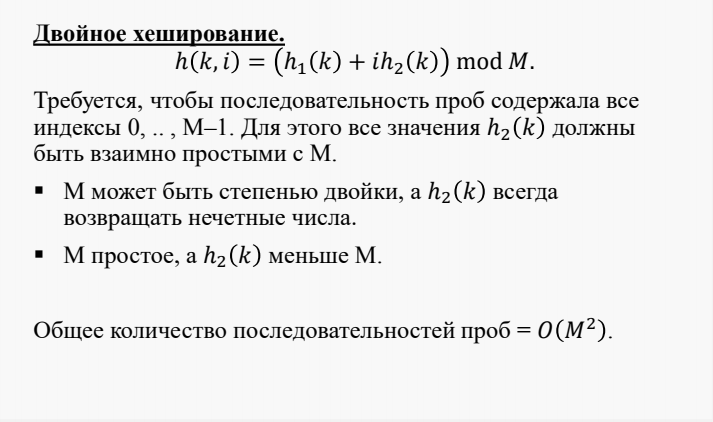

# Сравнить хэш-таблицы с различными способами разрешения коллизий.
_______________

# Содержание

* [Описание структуры](#op)
* [Метод цепочек](#cep)
* [Линейное опробование](#adr)
* [Двойное хеширование](#doub)
* [Области применения](#obl)
* [Сравнение и выводы](#cp)
*****  

## Описание структуры

  Этот шаблонный класс описывает объект, управляющий последовательностью элементов типа  
          `std::pair<const Key, Ty>`
  переменной длины. Последовательность слабо упорядочена хэш-функцией, которая разделяет последовательность в упорядоченный набор подпоследовательностей, называемых блоками. В каждом блоке функция сравнения определяет, упорядочена ли каждая пара элементов соответствующим образом. Каждый элемент содержит два объекта: ключ и значение. Последовательность представляется в виде, позволяющем выполнять поиск, вставку и удаление произвольного элемента несколькими операциями, которые могут не зависеть от числа элементов в последовательности (постоянное время), по крайней мере, когда все блоки имеют примерно одинаковую длину. В худшем случае, когда все элементы находятся в одном блоке, количество операций пропорционально количеству элементов в последовательности (линейное время). Кроме того, вставка элементов не делает итераторы недействительными, а при удалении элементов недействительными становятся только итераторы, указывающие на удаленный элемент.

  Хеш-функция должна иметь следующие свойства:

  * Всегда возвращать один и тот же адрес для одного и того же ключа;
  * Не обязательно возвращает разные адреса для разных ключей;
  * Использует все адресное пространство с одинаковой вероятностью;
  * Быстро вычислять адрес.
  
  При заполнении таблицы возникают ситуации, когда для двух неодинаковых ключей функция вычисляет один и тот же адрес. Данный случай носит название коллизия, а такие ключи называются ключи-синонимы.
  Для разрешения коллизий используются различные методы, которые в основном сводятся к методам цепочек и открытой адресации.
  
 ### Минимальный/Максимальный элемент
 
         int min ()     int max ()

  Значение минимального и максимального элемента находятся путем двойного обхода структуры. При первом обходе, min/max присваивается значение первого найденного элемента. При втором, путем сравненией определяется истинные min/max и записывываются в файл вывода. Оба обхода выполняются за O(n) в худшем случае.
  

 ## Метод цепочек 

  Каждая ячейка массива является указателем на связный список (цепочку) пар ключ-значение, соответствующих одному и тому же хеш-значению ключа. Коллизии просто приводят к тому, что появляются цепочки длиной более одного элемента.

   ### Вставка
  
         void add ( int key )
    
  Если выбран метод цепочек, то вставка нового элемента происходит за O(1)
 
   ### Поиск и Удаление
  
         bool has ( int key )     bool remove ( int key ) 
   
  Операции поиска или удаления данных требуют просмотра всех элементов соответствующей ему цепочки, чтобы найти в ней элемент с заданным ключом. Для добавления данных нужно добавить элемент в конец или начало соответствующего списка, и, в случае если коэффициент заполнения станет слишком велик, увеличить размер массива и перестроить таблицу.
  При предположении, что каждый элемент может попасть в любую позицию таблицы с равной вероятностью и независимо от того, куда попал любой другой элемент, среднее время работы операции поиска элемента составляет O(1+k), где k – коэффициент заполнения таблицы.
  Поиск в хеш-таблице с цепочками переполнения осуществляется следующим образом. Сначала вычисляется адрес по значению ключа. Затем осуществляется последовательный поиск в списке, связанном с вычисленным адресом.
  Процедура удаления из таблицы сводится к поиску элемента и его удалению из цепочки переполнения.
  
  Иллюстрация структуры 
  
  

 ## Линейное опробование

  В отличие от хеширования с цепочками, при открытой адресации никаких списков нет, а все записи хранятся в самой хеш-таблице. Каждая ячейка таблицы содержит либо элемент динамического множества, либо NULL.
  В этом случае, если ячейка с вычисленным индексом занята, то можно просто просматривать следующие записи таблицы по порядку до тех пор, пока не будет найден ключ K или пустая позиция в таблице. Для вычисления шага можно также применить формулу, которая и определит способ изменения шага. 
  Данный метод можно выполнять квадратичным,линейным и методом двойного хэширования. Последние 2 рассмотрим подробнее.
  Линейное опробование сводится к последовательному перебору элементов таблицы с некоторым фиксированным шагом
       
   ### Вставка
  
        void add ( int key )
        
        `i = 0
        a = h(key) + i*c
        Если t(a) = свободно, то t(a) = key, записать элемент, стоп элемент добавлен
        i = i + 1, перейти к шагу 2`
        
   ### Поиск и Удаление
          
         bool has ( int key )     bool remove ( int key ) 
  
  Аналогичным образом можно было бы сформулировать алгоритмы добавления и поиска элементов для любой схемы открытой адресации. Отличия будут только в выражении, используемом для вычисления адреса.
  
  С процедурой удаления дело обстоит не так просто, так как она в данном случае не будет являться обратной процедуре вставки.Дело в том, что элементы таблицы находятся в двух состояниях: свободно и занято. Если удалить элемент, переведя его в состояние свободно, то после такого удаления алгоритм поиска будет работать некорректно.Существует подход, который свободен от перечисленных недостатков. Его суть состоит в том, что для элементов хеш-таблицы добавляется состояние удалено. Данное состояние в процессе поиска интерпретируется, как занято, а в процессе записи как свободно.
  
  Иллюстрация структуры - 
  
  
  
  
 ## Двойное хеширование 
  
  Двойное хеширование аналогично линейному опробованию, за исключением того, что здесь используется вторая хеш-функция — для определения шага поиска, используемого после каждой коллизии. Шаг поиска должен быть ненулевым, а размер таблицы и шаг поиска должны быть взаимно простыми числами. Удаление реализуется аналогично линейному опробованию. На практике, мы создадим массив булевых переменных, каждая из которых будет соответсовать элементу таблицы. Теперь, при удалении, мы будем просто помечать наш объект как удалённый, а при добавлении, как не удалённый и замещать новым добавляемым объектом. При поиске, помимо равенства ключей, мы будем смотреть, удалён ли элемент и если да, то идти дальше.

  Выбор второй хеш-функции требует определенной осторожности, поскольку в противном случае программа может вообще не работать. Во-первых, необходимо исключить случай, когда вторая хеш-функция дает нулевое значение, поскольку при первой же коллизии это приведет к бесконечному циклу. Во-вторых, важно, чтобы значение второй хеш-функции и размер таблицы были взаимно простыми числами, т.к. иначе некоторые из последовательностей проб могут оказаться очень короткими (например, в случае, когда размер таблицы вдвое больше значения второй хеш-функции). Один из способов претворения этих правил в жизнь — выбор в качестве M простого числа и выбор второй хеш-функции, возвращающей значения, меньшие M. 
  
  Иллюстрация структуры - 
  
  

 ## Области применения
 
 Типичное применение хэш-таблиц -символьная таблица, которая ассоциирует некоторое значение (данные) с каждым членом динамического набора строк (ключей). Компилятор использует хэш-таблицу для управления информацией о переменных в вашей программе. Web-браузер использует хэш-таблицу для хранения адресов страниц, которые недавно посещались, а при соединении компьютера с Интернетом, она применяется для оперативного хранения (cache — кэширования) недавно использованных доменных имен и их IP-адресов.
 
 
 #  Сравнение и выводы
 
 В ходе работы были протестированы хэш-таблицы с различными спосабами разрешения коллизий. Отличия в реализации методов добавления, поиска и вставки представлены выше. Для тестирования к структурам были применены различные сценарии использования. Проверив корректность их работы и замерив время, необходимое для выполнения каждого из сценариев сделаем выводы о произвоизводительности при каждом способе.

 ## Тестирование и выводы
 
 При тестировании программе передовались 3 текстовых файла. Первый (1,2..7.dat) содержал набор комманд, варьирующихся в зависимоти от сценария использования. Вторый (1,2...7.ans) служил для вывода содержания структуры, командой print, а так же информации о (не)нахождении элемента в структуре, командой has. Третий (1,2,3,7.true) содержал полученный вручную результат, предпологаемый в первых 3х тестов и сравнивался программой (main.cpp) с вторым, на предмет истинности последнего. В случае одинакого содержания второго и третьего файла программа выводит в консоль сообщение "correct" и "not correct" в обратном случае. Кроме того программой подсчитывается время выполнения сценария каждой из структур, информация о нем так же выводится в консоль после названия структуры. 
 
 Тестирование производилось на ноутбуке macbook air 2014 года
 
 Пример вывода:
 
       Not correct

       Double_HT runtime = 20350
       Line_HT runtime = 24558
       Chain_HT runtime = 20688

 5 тестам соответвуют 5 сценариев использования. В первом, подсчитаем время необходимое для добавления в структуру 25 значений, удалим 5 из них и выведем структуру. Определим как структуры работают с малым количеством данных и проверим результат на корректность.

      correct 

      Double_HT runtime = 217
      Line_HT runtime = 102
      Chain_HT runtime = 91

 Во втором, подсчитаем время необходимое для добавления 7 значений, выведем структуру и 50 раз выволним поиск. Сравним работу поиска и проверим результат на корректность.

      correct

      Double_HT runtime = 895
      Line_HT runtime = 735
      Chain_HT runtime = 718

  В третьем,подсчитаем время необходимое для добавления 50 значений, удаления 45 из них и вывода структуры. Сравним время удаления и проверим результат на корректность.
 
       correct
       
       Double_HT runtime = 523
       Line_HT runtime = 672
       Chain_HT runtime = 612

  В четвертом, пятом и шестом тесте,подсчитаем время необходимое для добавление 500, 1500 и 5000 значений соотвественно. Сравним рост времени при росте числа операций. Результат их выполения программой не проверяется

       Double_HT runtime = 3258      Double_HT runtime = 13635     Double_HT runtime = 42813  
       Line_HT runtime = 1515        Line_HT runtime = 6975        Line_HT runtime = 60515
       Chain_HT runtime = 916        Chain_HT runtime = 5061       Chain_HT runtime = 34625
       
  В седьмом тесте,подсчитаем время необходимое для добавления 75 значений и поиска min/max после каждых 25. Выведем структуру. Проверим работу min/max на корректность.
  
       correct
       
       Double_HT runtime = 343
       Line_HT runtime = 287
       Chain_HT runtime = 254

      
 Выводы: При каждом из сценариев лучшие результаты показывает хэш таблица, использующая для разрешения коллизий дополнительные цепочки. Но они и являются главным недостатком, так как значения не хранятся в самой таблице и занимают, а массивы с ними занимают дополнительную память. Метод линейного опробования и метод двойного хэширования в целом схожи. Первый, при небольшом количестве элементов, работает в разы быстрее, но с ростом количества элеменнтов сначала разница во времени работы уменьшается а позже и вовсе рнонходит в пользу второго. Математическое подтверждение:
 
 
 
 
 
 
 
## Инструкция по использованию

Файлы содержащие тестовые сценарии (.dat) и результаты их корректного выполнения (.true) находятся в папке "tests".

Следует сохранить необходимый сценарий как файл in.txt, а его корректное исполнение как true.txt. Кроме того создать файл out.txt.

В среде Linux, в терминале прописываем g++ main.cpp, после у нас появится файл a.out. Передаем ему файлы строкой: ./a.out in.txt out.txt true.txt

После вышеуказанных действий, в файле out.txt появятся результыты исполнения прогрыммы.

В терминале мы увидим время работы каждой структуры в миллисекундах и корректность исполнения комманд (correct/not correct).

## Входные/Выходные данные

На вход программе передаются абсолютные пути на 3 текстовых файла, с расширениями:

  * .dat, содержит набор неообходимых комманд тестирования ;
  * .ans, служит для вывода состояния структуры и рультатов выполнения команд;
  * .true, содержит истинный результат выполнения программы;
  
 Файлы 1,2,..7.dat содержат входные данные в формате command [key] [data], где command - одна из команд (print,min, max, add, search, delete), 
key - целочисленный ключ, data - целочисленное значение.
  
  * print - записывает текущее состояние структуры в файл вывода, вида: [ключ]->[значение]. При методе "цепочек", каждая "цепочка" выводится на отдельной строке
  * max - записывает наибольший ключ в файл вывода
  * min - записывает наименьший ключ в файл вывода
  * add - требует параметры key и data, добавет элемент в структуру 
  * search - требует параметр key, ищет указанный ключ в структуре
  * delete - требует параметр key, удаляет ключ и соотвествующее ему значение из структуры

  
 На выходе программа:
 
  * заполняет файл .ans, результатами выполнения выполнения команд, для каждой структуры. Результаты каждой структуры подписанны их методом разрешения коллизий.
  * выводит в консоли информацию о корректности (correct/not correct) и времени тестирования (в микросекундах);

 
 
 
